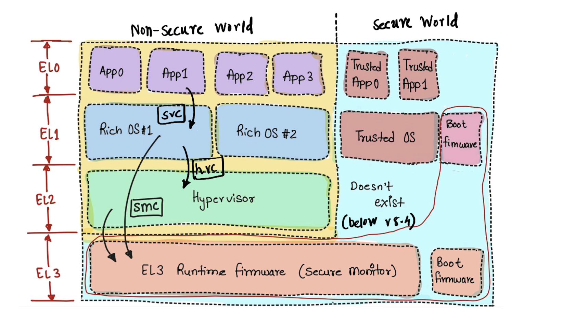

ARM-A is the most prevalent architecture out there powering billions of devices. We will be covering these topics over the course of multiple articles in this series.

<!--more-->

# Exception Levels and Security States

Hey there! If you’re diving into the ARMv8-A architecture you might benefit from this writeup.

ARM-A class are a beast of a system, with layers of control and security (sometimes I feel like they are a bit of an overkill). But that's what makes it both powerful and complex.

In this one, we will walk through the exception levels (EL0 to EL3) and the security states (Non-secure and Secure). These are the backbone of how ARMv8-A organizes privilege, isolation, and trust. 

## What’s ARMv8-A?

Before we jump into the nitty-gritty, let’s set the stage. ARMv8-A is the architecture behind most modern 64-bit ARM processors (think Cortex-A series, like the ones in your phone or in your latest Mac Mx chip or in server class CPUs). 

It’s designed for flexibility, supporting everything from bare-metal IoT devices to full-blown operating systems like Linux or Android. The key to its power lies in how it manages privilege and security through _exception levels_ and _security states_. These concepts sort of govern who can access what, when, and how—whether it’s an app, an OS kernel, a hypervisor, or a trusted OS or a secure firmware.



## Exception Levels:-

ARMv8-A organizes its processing modes into four exception levels, namely -  EL0, EL1, EL2, and EL3. Think of these as a stack of privilege, where higher numbers mean more control over the system. Each level runs specific types of software, and the transitions between them are tightly controlled. 

### EL0: The Unprivileged World (User Apps)

EL0 is where your everyday applications live—think your browser, games, or that random app you downloaded. It’s the least privileged level, meaning it has zero direct access to hardware or sensitive system resources. Code running at EL0 is boxed in by the operating system, which enforces strict boundaries.

* User applications, like those Android apps or Linux processes run here.
* No direct hardware access. Everything goes through system calls to higher levels.
* EL0 code can’t even touch the memory management unit (MMU) configuration. The page tables it uses are set up by EL1 (the OS), and EL0 has to trust them blindly. This isolation is great for security as third-party code should seldom be trusted.

Below code snippet makes a system call request to EL1 from EL0 (in AArch64 assembly). We take an example of `write()` system call which we seldom have to bother about given we use a nice wrapper like `printf()`.

```
mov x8, #64    // Syscall number for 'write'
mov x0, #1     // File descriptor (stdout)
ldr x1, =msg   // Pointer to the message string.
mov x2, #13    // Length of message
svc #0         // System call to EL1

msg:
.asciz "Hey from EL0, this message is for EL1\n"
```

The `svc` instruction triggers an exception, handing control to EL1. The EL0 user space code has no idea how EL1 handles this—it’s completely dependent on the OS.

### EL1: The OS / Kernel Layer

EL1 is where the operating system kernel runs, like Linux or Windows. It’s got way more power than EL0, with direct access to hardware resources like the MMU, interrupts, and most system registers. This is where the OS manages processes, schedules tasks, and sets up memory mappings.

* OS kernels, device drivers, and anything that needs low-level system control run here
* EL1 can configure the system but is still subject to restrictions from higher levels (EL2 or EL3). We will look this in more detail in a bit.
* For the most part, we can assume EL1 layer has full view of the hardware but it is not a true statement to make for all the use-cases. E.g. Server class applications which have `Hypervisor` enabled. Please just stay with me for a while, I promise more details are coming in the `EL2` section.

Code snippet (remember we are only highligting very key details, rest is deliberalety omitted) of EL1 handler for the `svc` call from EL0:

```
// Vector table entry for synchronous exception at EL1
sync_exception_entry:
    mrs x9, esr_el1     // Read Exception Syndrome Register
    and x10, x9, #0x3F  // Extract exception class
    cmp x10, #0x15      // Check whether it was supervisor call (0x15 is the value for svc from EL0)
    b.eq svc_handler
    // Code for handling other sync exceptions
svc_hanlder:
    // Read the syscall # (from x8 and handle it appropriately)
    eret                // Return to EL0 (we will also have to modify spsr, we will cover in detail in next series of articles)
```

The goal of this code snippet is to demo out the steps involved in handling an `svc` exception. This is by no means complete but I believe if we weed out the details, we should see some 7-8 instructions that should inspire us that this can be grappled with. But, we will un-cover the details in later artciles.

### EL2: Hypervisor - (I like to think of it as `Scheduler for Kernels/VMs`)

EL2 is where hypervisors live—think KVM, VirtualBox or VMware. It’s designed for virtualization, allowing a hypervisor to manage multiple guest operating systems (each running at EL1). EL2 has more privilege than EL1, letting it control virtualized hardware and intercept certain operations from guest OSes.

* Hypervisors or virtual machine monitors (VMMs) run here. They are kernels for kernels (if that makes sense !)
* EL2 can trap and emulate hardware accesses from EL1, giving it fine-grained control over guest OS behavior.
* `hvc` instructions is a synchronous way to request the services of Hypervisor by EL1 layer.
* EL2’s job is to schedule and provide an envrionment where multiple OSes/Kernels can co-exists and run. They provide an isolated view to each of the kernel (making them believe they are the king of the castle). This often means that, they will have to spoof certain transactions or even memory-maps, intercept certain interrupts to achieve this (Again, I will request you to bear with me and wait for these details to be shared in the next articles). 

This code snippet shows at high level the handling of `hvc` (Hypervisor call) from EL1 layer (Guest OS or Virtual Machine).

```
// Vector table entry for synchronous exception of EL2
sync_exception_entry:
    // ESR_EL2 contains the exception cause details
    mrs  x0, esr_el2         // Exception Syndrome Register
    ubfx x1, x0, #0, #26     // Extract syndrome
    ubfx x2, x0, #26, #6     // Extract exception class (EC)
    cmp x2, #0x16            // Check whether it was hypervisor call (0x16 is the value for hvc from EL1)
    b.eq hvc_handler
    // Code for handling other sync exceptions

hvc_handler:
    // Read HVC immediate value (passed via hvc #imm_id)
    ubfx x3, x1, #0, #16    // Extract immediate value from ISS

    // E.g. Handle specific HVC call (e.g., imm_id == 0x1 for guest info request)
    cmp x3, #0x1
    b.eq hadnle_guest_info

    // Handling of other HVC imm_ids
    ...
    ...

return_to_el1:
eret                   // Return to EL1 (we will also have to modify spsr, we will cover in detail in next series of articles)
```

### EL3: The Secure Monitor

EL3 is the most privileged level, reserved for the _secure monitor_—a piece of firmware that manages transitions between the Secure and Non-secure worlds (more on this in just a bit). It’s typically used for trusted boot, or handling sensitive operations like finger-print or face-auth, cryptographic key management, etc.

* Secure monitor code, like ARM’s Trusted Firmware. Switcher of the worlds!
* `smc` instruction is a synchronous way to request the services of EL3 Monitor by EL1 or EL2 layers.
* EL3 has a full and total view and control of the system. The code running here is fully trusted and often supplied by the SoC vendor. This layer is designed and implemented in such a way that it can be assumed that it will be sort of unsurmountable fortress which will be hard to break or bypass.

Here’s a snippet of EL3 code handling a secure monitor call (`SMC`):

```
// Vector table entry for synchronous exception at EL3
sync_exception_entry:
    mrs x9, esr_el3     // Read Exception Syndrome Register
    and x10, x9, #0x3F  // Extract exception class
    cmp x10, #0x17      // Check whether it was secure monitor call (0x17 is the value for smc from EL1/EL2)
    b.eq smc_handler
    // Code for handling other sync exceptions
smc_hanlder:
    // Based on the request ID, decide whether switch to secure world is needed or not
    // If needed modify SCR_EL3 appropriately and then return
    eret  
```

## Security States: Secure vs. Non-secure Worlds

Now, let’s talk about the _security states_: Secure and Non-secure. ARMv8-A splits the system into two worlds to isolate sensitive operations (like handling encryption keys) from regular code (like your OS or apps). This is part of ARM’s TrustZone technology.

* **Non-secure world:** This is where most software runs—your OS, apps, and even hypervisors (EL0, EL1, EL2). It’s “untrusted” in the sense that it can’t access Secure world resources.
* **Secure world:** This is the trusted side, typically limited to EL3 (secure monitor) and sometimes a secure OS at EL1. It’s where sensitive operations happen, like secure boot or trusted applications like finger-print auth, crypto functions, etc.

The secure monitor (EL3) acts as a gatekeeper, using the `scr_el3` (Secure Configuration Register) to control and switch between the two worlds. The snippet shows that switch from NS to S world.

```
// scr_el3 to switch to secure world
mrs x0, scr_el3
orr x0, x0, #1     // Set NS bit to 0 (Secure world)
msr scr_el3, x0
isb
// Set elr_el3 correspondingly
eret               // Control would be transferred to secure world post the exception return
```

If you've stayed with me so far, I mean kudos to you! What a mouthful was all of that! My request and hope is that if revisited often, this will start making sense and we'd feel comfortable about the architectural design. Please feel free to revisit this if you'd like to torture yourself some bit more :)

But, jokes aside, we have covered a lot but still a lot more is to go. We have omitted (deliberately) a lot of details which we will un-cover in the next artciles. We’ll dig into the memory management system—page tables, translation regimes, and why cache coherence, interrupt handling and more.

I will see you in the next one!
