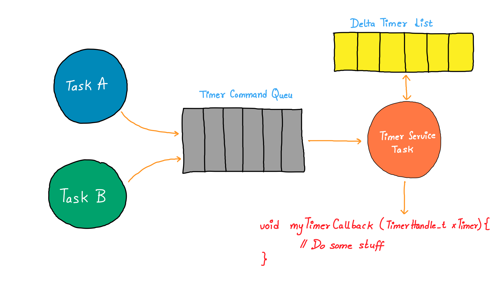
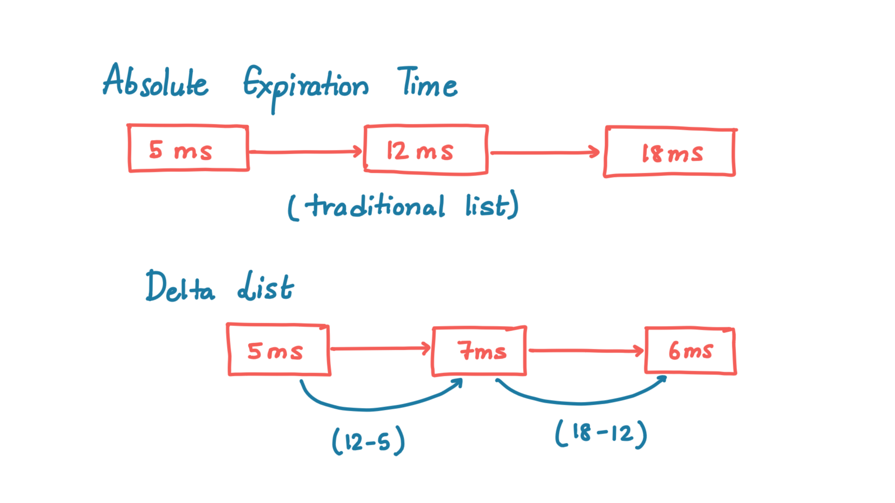

---
date: "2025-02-16"

title: 'Optimizing Timer Management in Embedded Systems with Delta Lists'

thumbnail: "/posts/delta_lists_for_timers/thumbnail.png"

author: "neeraj1397"

tags:
  - "timers"
  - "linkedlists"
  - "embeddedsystems"

categories:
  - "Embedded Timers"

<!--more-->




# Optimizing Timer Management in Embedded Systems with Delta Lists

Efficient timer management is a crucial aspect of embedded systems, especially in applications requiring low-power operation, RTOS scheduling, or precise event timing. One of the most efficient ways to manage multiple software timers is 
the delta list approach, which significantly reduces CPU overhead and optimizes wake-up schedules.

This short article explores delta lists, how they work, and why they are widely used in low-power MCUs, real-time operating systems (RTOS), and networking applications.

## The Challenge: Managing Multiple Timers Efficiently

Embedded systems often rely on multiple software timers to schedule periodic tasks. These timers may be used for:

✅ Power-saving modes (e.g., Wi-Fi sleep intervals)  
✅ Sensor data sampling (e.g., wake up every 10 ms)  
✅ RTOS task scheduling  
✅ Periodic communication events (e.g., sending a heartbeat message every 100 ms)

A naive approach would be to store all timers in an unsorted list and check each one on every tick. However, this leads to unnecessary CPU cycles and power consumption, especially in low-power IoT devices.

A better approach is to use a delta list, which optimizes timer updates and reduces processing overhead.

## What is a Delta List?

A delta list is a sorted linked list where each timer stores a relative time difference (delta) rather than an absolute expiration time. Instead of keeping track of exact timestamps, the difference between consecutive timers is stored and updated 
dynamically.

### Example

Consider three timers set to expire at 5 ms, 12 ms, and 18 ms. Instead of storing absolute values:

**Traditional Timer List (Absolute Expiration Times):**
```
[5 ms, 12 ms, 18 ms]
```

A delta list stores:
```
[5 ms, (12 - 5) ms, (18 - 12) ms] → [5 ms, 7 ms, 6 ms]
```

Each timer now holds only the time difference from the previous one.



## How the Delta List Updates

1. The first timer (5 ms) expires.
2. The next timer’s delta is adjusted by subtracting the expired timer’s value:
   - **Updated list →** `[7 - 5, 6] → [2 ms, 6 ms]`
3. The next timer (2 ms) expires, updating the list further.

This way, only one timer is checked at a time, significantly reducing CPU workload.

## Advantages of Delta Lists

✅ **Lower CPU Overhead** – No need to check all timers every tick.  
✅ **Optimized Wake-Ups** – Reduces unnecessary processor wake-ups in low-power systems.  
✅ **Efficient RTOS Scheduling** – Faster execution of task delays and periodic timers.  
✅ **Scalability** – Can efficiently handle hundreds of software timers.  

## Where are Delta Lists Used?

### 1. Power-Saving in Wi-Fi MCUs

Wi-Fi chipsets implement sleep modes where the radio and processor are turned off, except for periodic wake-ups to receive beacons or transmit keep-alive messages.

A delta list allows the system to wake up only when necessary, reducing energy consumption in battery-powered IoT devices.

### 2. RTOS Timer Management

In real-time operating systems (RTOS), multiple tasks may require timers for periodic execution. Instead of iterating through a full list, an RTOS can use a delta list to track only the next event, improving scheduling efficiency.

### 3. Sensor Data Collection

IoT devices often sample sensors at precise intervals (e.g., reading temperature every 500 ms). A delta list ensures that the next sampling event is handled with minimal overhead, optimizing energy efficiency in battery-operated systems.

## Implementation: Delta List in C

Below is a simple C implementation of how a delta list updates timer values:

```c
void update_delta_list(void) {
  sleeptimer_tick_count_t current_cnt = sleeptimer_get_counter();
  sleeptimer_timer_handle_t *timer_handle = timer_head;
  sleeptimer_tick_count_t time_diff = current_cnt - last_delta_update_count;

  while (timer_handle != NULL && time_diff > 0) {
    if (timer_handle->delta >= time_diff) {
      timer_handle->delta -= time_diff;
      time_diff = 0;
    } else {
      time_diff -= timer_handle->delta;
      timer_handle->delta = 0;
    }
    timer_handle = timer_handle->next;
  }
  last_delta_update_count = current_cnt;
}
```

### Explanation of the `update_delta_list` Function

#### **1. Capture the Current Timer Count**
```c
sleeptimer_tick_count_t current_cnt = sleeptimer_get_counter();
```
- Retrieves the current tick count from the hardware timer.
- Represents the current time in ticks.

#### **2. Initialize Pointers and Calculate Time Difference**
```c
sleeptimer_timer_handle_t *timer_handle = timer_head;
sleeptimer_tick_count_t time_diff = current_cnt - last_delta_update_count;
```
- `timer_head` points to the first timer in the delta list.
- `time_diff` stores the time elapsed since the last update.

#### **3. Traverse and Update the Delta List**
```c
while (timer_handle != NULL && time_diff > 0) {
```
- Iterates through timers while elapsed time exists.

#### **4. Adjust Delta Values**
```c
if (timer_handle->delta >= time_diff) {
  timer_handle->delta -= time_diff;
  time_diff = 0;
} else {
  time_diff -= timer_handle->delta;
  timer_handle->delta = 0;
}
```
- Reduces timer `delta` by elapsed time, ensuring accurate scheduling.

#### **5. Move to the Next Timer**
```c
timer_handle = timer_handle->next;
```
- Moves to the next timer in the list.

#### **6. Update the Last Update Time**
```c
last_delta_update_count = current_cnt;
```
- Saves the latest tick count for future updates.

## Potential Challenges and Limitations

While delta lists offer significant advantages, they also come with some challenges:

🚫 **Insertion Complexity** – Adding a new timer requires traversing the list to find the correct position, which may not be ideal for systems with frequent timer insertions.  
🚫 **Not Suitable for Random Access** – Unlike an array-based timer system, delta lists require sequential traversal, making random access inefficient.  
🚫 **Interrupt Handling Overhead** – Updating the list inside an ISR (Interrupt Service Routine) might introduce latency if not optimized properly.  
🚫 **Memory Fragmentation** – Since delta lists rely on linked lists, they may contribute to memory fragmentation in heap-based allocations.  


## Conclusion

The delta list approach is a powerful method for managing software timers efficiently in embedded systems, Wi-Fi chipsets, RTOS environments, and IoT devices. By reducing CPU wake-ups and optimizing scheduling, it plays a crucial role in power management and real-time execution.

