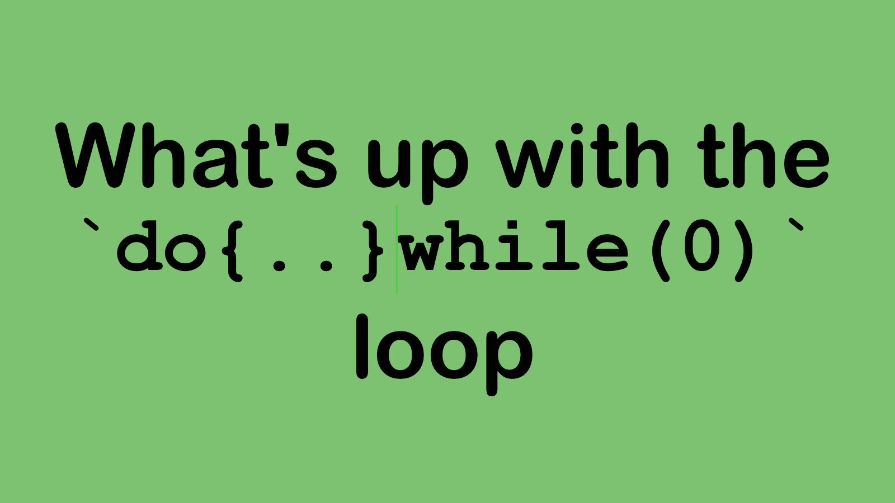

---
# Change the Date below
date: "2025-02-13"

# Add the title of the Post here
title: 'Title of the Post'

# replace the "sample/cover.png" with path to a 16:9 image
# this image will be shown in SEO optimization and when
# you share the post on social media.
thumbnail: "/posts/sample/cover.png"

# Add your GitHub handle here
author: ""

# Add tags as suitable for the topic
tags:
  - ""

# If it fits a certain category of topics, add that
categories:
  - ""

# If this is a Series of posts, Add the name of the series
series:
  - ""

# Delete the line below when submitting for review
draft: true
---

Start to write your post here. Think of this section as the summary, the details can go below the `<!--more-->` marker. This marker separates the summary of the post from the details.


# Understanding do-while(0) in C Macros

We read about loops in C, and we often comeacross while, for, if-else which made sense to me. But there's one consrtuct I could never make sense of. do-while. Everything that can be achieved by do-while can be achieved by using a while() loop. why did Dennis Ritchie even create this? There has to be a reason. I think I found one of the reasons.
There is a scenario where do-while shines. infact, its the only solution to think of to do that thing.

Before you contiue to the article below, make sure of your understanding about #define MACROS. Trust me, this is an interesting use case. 


<!--more-->


## Overview
In C programming, the `do-while(0)` construct is a common idiom used in macro definitions. While it might seem counterintuitive at first, this pattern serves several important purposes and helps prevent subtle bugs in macro usage.
we will address a problem, and use do-while to solve it. 

## The Problem
When creating multi-statement macros, several issues can arise:

1. Multiple statements in a macro might not work correctly in all contexts
2. The macro might not behave as a single statement
3. Issues with trailing semicolons can cause unexpected behavior. 

Consider this simple macro:

```c
#define UNSAFE_MACRO(x) statement1(x); statement2(x)
```

This can lead to problems in conditional statements:

```c
if (condition)
    UNSAFE_MACRO(x);  // Expands to statement1(x); statement2(x);
else
    other_statement();
```

After preprocessing, this becomes:
Here, the `if (condition)` only executes `statement1(x);`. Upon that, we have a dangling else condition, creating a syntax error.
```c
if (condition)
    statement1(x);
    statement2(x);  // This is now outside the if block!
else
    other_statement();  // Syntax error: else without if
```
## Another approach
Lets try using curly braces.

```c
#define UNSAFE_MACRO(x) {statement1(x); statement2(x);}
```
The code:
```c
if (condition)
    UNSAFE_MACRO(x);  // Expands to statement1(x); statement2(x);
else
```

The above code would expand to;
```
```c
if (condition)
    {statement1(x); statement2(x);}
else
    
```


## The Solution: do-while(0)

Using `do-while(0)` solves these issues:

```c
#define SAFE_MACRO(x) do { \
    statement1(x); \
    statement2(x); \
} while(0)
```

### Why It Works

1. **Single Statement**: The `do-while` construct makes the entire macro act as a single statement, even with multiple internal statements.
2. **Semicolon Friendly**: It requires a trailing semicolon, maintaining consistent C syntax.
3. **No Runtime Overhead**: The `while(0)` is optimized away by the compiler.
4. **Block Scoping**: Variables declared inside the macro remain local to the macro.

### Common Misconceptions

Some developers try to use simple braces:

```c
#define BROKEN_MACRO(x) { \
    statement1(x); \
    statement2(x); \
}
```

This fails because of the trailing semicolon problem:

```c
if (condition)
    BROKEN_MACRO(x);  // Expands to { statement1(x); statement2(x); };
else
    other_statement();  // Syntax error!
```

## Best Practices

1. Always use `do-while(0)` for multi-statement macros
2. Use backslashes for line continuation in macro definitions
3. Enclose all statement parameters in parentheses
4. Use block scope when declaring variables inside macros

## Example

Here's a complete example showing proper macro usage:

```c
#define SWAP(a, b) do { \
    typeof(a) temp = (a); \
    (a) = (b); \
    (b) = temp; \
} while(0)

int main() {
    int x = 5, y = 10;
    if (x != y)
        SWAP(x, y);
    return 0;
}
```

## Conclusion
While the `do-while(0)` construct might look strange at first, it's a vital tool for creating safe and reliable macros in C. Understanding this pattern is essential for writing robust C code.

## Further Reading
- The C Programming Language (K&R)
- GNU C Preprocessor Manual
- C99 Standard

Do not remove the `<!--more-->` marker. Continue to write your article in the markdown format.

# Note on images

All images can have local path and the caption can be added next to the path as in the example below

```

```



