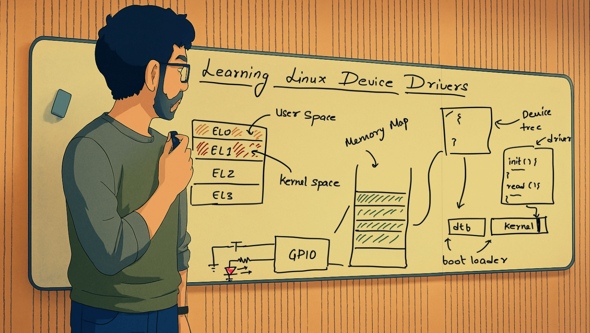

Most Linux device driver engineers cannot reason about how the Linux kernel boots or how a device driver is loaded. This post details how you should learn to write device drivers by being able to reason down to the hardware level.

<!--more-->

I come from a background in microcontrollers and firmware development and became interested in learning about Linux device drivers. Predicting and understanding kernel behavior was straightforward for me, as I tend to consider what the system will do as a result of my code. Here are my recommendations on how you should learn kernel driver development.

The kernel is designed to be generic and provide general operating system facilities such as resource, power, and process management, among others. Kernel developers don’t necessarily know what hardware (CPU and peripherals) the kernel will run on. For these reasons, it cannot directly boot on specific hardware.

# 1. Programmer's Models

Programmer's models are abstractions of the hardware that programmers can use to control it. These abstractions hide circuit-level details and provide interfaces, typically registers, that the programmer can read from and write to.

Most kernel developers don’t start here; instead, they begin with "writing a simple kernel module." In my opinion, this is a significant mistake. While they can then write a basic driver, in my experience, they struggle to reason about the underlying mechanics, which makes their drivers fragile and unstable.

Programmer's model include the following:
1. **CPU Boot Flow:** Details of the `control`, `status`, and `general-purpose` registers, as well as the Instruction Set Architecture (`ISA`).
1. **Exception Model:** This covers the details of how the CPU handles and responds to interrupts (external events) and exceptions (internal events).
1. **Memory Model:** This explains how the CPU interacts with the memory subsystem and how reads and writes are performed.
1. **Debug Model:** Each CPU comes with hardware that assists in examining the CPU registers.

You don’t need to master these models, but you should be aware of them. Whichever CPU the kernel is running on, you should know how to dive into and reason about the various models listed above.

> I recommend working with ARM64 (AArch64)-based CPUs. They are widely used in servers, personal devices (phones, tablets, watches, etc.), automobiles, and more.

# 2. Bootloaders

The Linux kernel doesn’t directly boot on the CPU. Instead, it is loaded by firmware known as the `bootloader`.

There are typically multiple stages in the boot process, and everything prior to the kernel taking over the CPU is referred to as bootloaders. Terms like Primary, Secondary, and Secure Resident are just fancy names based on the specific functionality they implement, but ultimately, they are all preparing the system to be handed over to the kernel.

What do I mean by specific functionality? Well, the ROM code, for example, usually comes preloaded from the factory and is typically responsible for powering on critical parts of the system. After that, it transfers control (by directing the CPU to the code of another bootloader) to a subsequent bootloader, which may perform security checks, install secure firmware (such as trusted execution environments), turn on and train the DRAM, and so on. This bootloader usually transfers control to yet another bootloader or locates and loads the kernel.

# 3. Bare-metal Boot

Being able to boot a CPU from scratch enables one to reason about the functionality of a bootloader. Additionally, it is a good way to learn about the CPU and all the models listed in the previous section.

A good approach is to learn the boot sequence of the intended processor and then write a simple assembly program to jump into a C function. Typically, what I do is write a driver for a UART (Universal Asynchronous Receiver and Transmitter) in the C language and output "Hello, World!" on the serial terminal. The C functions corresponding to the UART driver are called from the assembly code.

The second thing I do is toggle a GPIO (General Purpose Input/Output) pin. This gives me a sense of how the peripherals need to be programmed. Programming the CPU using bare-metal code will enable learning the following important skills/topics:
1. CPU Instruction Set Architecture.
1. The Compiler Toolchain utilities (gcc, gdb, ld, as, etc).
1. Build tools, Linker Scripts and Makefiles.
1. Reading SoC (System On Chip) datasheet [^1].

# 4. The Device Tree

I noted above that the kernel is unaware of the hardware (SoC) it will be booted on. The kernel requires certain hardware blocks to be functional for it to operate correctly. For example, the system timer is required to enable periodic switching between processes.

The question we should ask ourselves is: "How does the kernel become aware of the hardware it is running on?"

The answer is `the device tree`!

It is a data structure format in which the hardware layout is represented. The device tree is represented in a text file that is later compiled into something called a `device tree binary object` (**dtbo**). There will be a device tree source (written and mainlined to the kernel source by engineers of the given SoC manufacturer) corresponding to the specific hardware. This source is compiled using the device tree compiler and converted into the binary format.

The next question is: How does the kernel obtain the device tree binary object to learn about the hardware layout? The answer: The bootloader passes it.

The **dtbo** file is placed at a specific location in memory, and its address is written into a designated CPU register before control is handed over to the kernel image. Once the kernel image begins to execute, it reads the hardware configuration and determines which drivers need to be loaded, among other things.

# 5. Driver for the GPIO block

The device tree encodes, along with the details of the hardware, the drivers that the kernel can use to manage the device. These drivers are compiled as part of the kernel image. Where is the device driver source, you ask? The `kernel code source`.

One should consider writing a device driver to control the state of a GPIO pin (assuming an LED is connected to it) by developing a device driver. Writing it will expose you to the details of how memory-mapped I/O can be manipulated from within the driver and how the driver needs to be linked to the block through the device tree.

The success criterion for this could be that the LED needs to turn on or off based on the reads and writes to the device file.

This truly is the ultimate project one can undertake to learn device drivers the right way. In my opinion, the best platform for this is any of the single-board computers (I prefer the Raspberry Pi).

# 6. Enabling Interrupts

Interrupts are a very common occurrence in the device driver world, and being able to configure a GPIO as an interrupt source and manage it with the driver is the final know-how you’ll need before you can claim to be a device driver developer. Consider extending the driver in the section above to account for a GPIO as an interrupt source.

I like to program a GPIO as an interrupt source and then generate the interrupts by pressing the button attached to it.

# 7. Master Kernel Facilities

This is what vanilla device driver developers use right from the start. Kernel facilities are frameworks and helpful features that the kernel provides to simplify device driver development. Things like `queues`, `work queues`, `timer queues`, `mutexes`, `semaphores`, etc., are examples of kernel facilities.

Knowing how to use these will not only help you make the raw driver more robust and production-ready but also enhance your toolkit of skills.

# Final Thoughts

To me, a true kernel driver developer can reason very clearly from the boot process all the way to how the driver controls the hardware. In my view, the seven steps above are how one can achieve that level of proficiency.

[^1]: The CPU is usually part of System on Chip.
