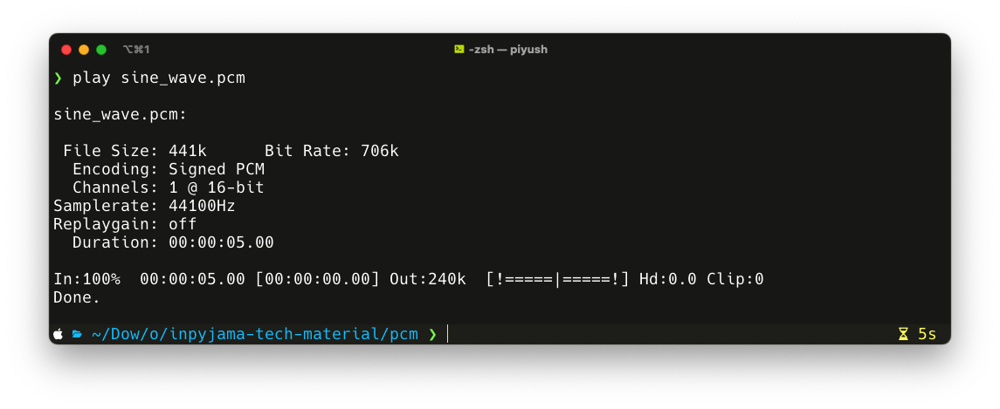

Pulse-Code Modulation (PCM) is a method used to digitally represent analog signals, particularly audio. It works by sampling the amplitude of an analog signal at regular intervals and then quantizing those samples into a series of discrete numerical values. These values are stored or transmitted as binary data, making PCM a foundational technique for digital audio in computers, CDs, DVDs, and other media.

<!--more-->

PCM converts the continuous wave of an analog audio signal into a sequence of numbers that can be processed, stored, or reproduced by digital systems. It’s widely regarded as a "raw" or uncompressed form of digital audio because it doesn’t involve data compression, preserving the original signal’s fidelity as closely as possible within the limits of sampling and quantization.

Imagine you’re trying to capture the sound of a wave—say, someone speaking or a guitar strum. An analog signal is continuous, meaning it flows smoothly with infinite detail over time. But computers can’t store infinite detail; they need discrete, finite numbers. PCM solves this by taking "snapshots" of that analog wave at regular intervals and turning it into a digital format. It happens in three main steps:

1. **Sampling**: The analog signal is measured at fixed points in time. For example, in CD-quality audio, it’s sampled 44,100 times per second (44.1 kHz). The more samples per second, the more accurately the original sound is captured—up to a point defined by something called the Nyquist theorem, which says you need at least twice the highest frequency you want to record.
1. **Quantization**: Each sample’s amplitude (how loud it is) gets rounded to the nearest value on a finite scale, like a grid. In CDs, this is typically a 16-bit scale, meaning there are 65,536 possible levels. Higher bit depths (like 24-bit) give finer detail but use more data.
1. **Encoding**: These sampled and quantized values are stored as binary numbers—1s and 0s—that a computer or digital device can understand and later convert back to sound.

The result? A digital version of the sound that’s close to the original. When you play it back, a device like a DAC (digital-to-analog converter) reconstructs the wave from those numbers, and you hear music or speech.

PCM is uncompressed, so it’s raw and takes up more space compared to formats like MP3, which shrink the file by tossing out less noticeable details. That’s why PCM is a go-to for high-quality audio where fidelity matters, like in studios or Blu-ray discs. It’s straightforward, widely supported, and doesn’t mess with the sound—just captures it as it is.

> What we will now attempt to do is - hand code the samples for a sine wave in the PCM format and have the computer play it!

## PCM File Format in Detail

PCM itself isn’t a "file format" in the traditional sense—it’s a method of encoding audio data. However, when PCM audio is saved to a file, it’s typically stored in a container format like WAV (Waveform Audio File Format) or AIFF (Audio Interchange File Format), which wrap the raw PCM data with metadata. Below, I’ll break down how PCM data is structured and stored, focusing on its raw form and common container usage, presented in Markdown.

### Raw PCM Data Structure
Raw PCM data is a stream of binary numbers representing audio samples. Its structure depends on three key parameters:

1. Sampling Rate
    - The number of samples taken per second from the analog signal.
Common rates: 44.1 kHz (CD quality), 48 kHz (professional audio), 96 kHz (high-resolution audio).
    - Example: At 44.1 kHz, 44,100 samples are recorded per second.

1. Bit Depth
    - The number of bits used to represent each sample, determining the dynamic range (difference between the quietest and loudest sounds).
    - Common depths: 16-bit (65,536 possible values), 24-bit (16.8 million values), 32-bit (over 4 billion values).
    - Higher bit depth = better precision and lower noise floor.

1. Channels
    - The number of audio streams (e.g., 1 for mono, 2 for stereo).
    - Samples are interleaved in multi-channel audio (e.g., Left1, Right1, Left2, Right2).

### Raw PCM Example:
- For a 1-second stereo clip at 44.1 kHz and 16-bit depth:
    - Samples per second: 44,100
    - Channels: 2
    - Bits per sample: 16 (2 bytes)
    - Total data: 44,100 × 2 × 2 = 176,400 bytes (about 172 KB).

Raw PCM has no header or metadata—it’s just the sample values. This simplicity makes it flexible but requires external context (e.g., a separate note about the sampling rate) to interpret correctly.

## PCM in WAV Format

WAV is the most common container for PCM audio. It adds a header to the raw PCM data for compatibility. Here’s the structure in Markdown:

### WAV File Structure

| Section       | Description                              | Size (Bytes)      |
|---------------|------------------------------------------|-------------------|
| **RIFF Header** | Identifies the file as WAV             | 12                |
|   Chunk ID    | "RIFF" (ASCII)                           | 4                 |
|   Chunk Size  | Size of the entire file minus 8 bytes    | 4                 |
|   Format      | "WAVE" (ASCII)                           | 4                 |
| **fmt Chunk** | Format details                           | 16+ (typically 16)|
|   Chunk ID    | "fmt " (ASCII)                           | 4                 |
|   Chunk Size  | Size of this chunk (usually 16)          | 4                 |
|   Audio Format| 1 for PCM (other values for compression) | 2                 |
|   Num Channels| 1 (mono), 2 (stereo), etc.               | 2                 |
|   Sample Rate | e.g., 44100 Hz                           | 4                 |
|   Byte Rate   | Sample Rate × Channels × Bits/8          | 4                 |
|   Block Align | Channels × Bits/8 (bytes per sample)     | 2                 |
|   Bits/Sample | e.g., 16                                 | 2                 |
| **data Chunk**| The raw PCM audio data                   | Variable          |
|   Chunk ID    | "data" (ASCII)                           | 4                 |
|   Chunk Size  | Size of the PCM data                     | 4                 |
|   PCM Data    | Interleaved sample values                | Variable          |

**Note**:
- The fmt chunk specifies that the audio is PCM (Audio Format = 1).
- The data chunk contains the raw PCM samples, identical to what you’d see in a headerless PCM file.
- WAV files can technically store compressed audio, but PCM is the default and most common.

### Coding this up as a C file

```c
#include <stdio.h>
#include <stdint.h>
#include <math.h>
#include <string.h>

#define SAMPLE_RATE 44100   // Sample rate (Hz)
#define DURATION    5       // Duration of the tone (seconds)
#define AMPLITUDE   32767   // Amplitude of the tone (maximum 32767 for 16-bit PCM)

typedef struct {
    char   chunkID[4];       // "RIFF" for little-endian
    uint32_t chunkSize;      // Total file size - 8 bytes
    char   format[4];        // "WAVE"
    char   subChunk1ID[4];   // "fmt "
    uint32_t subChunk1Size;  // Size of the fmt sub-chunk (16 for PCM)
    uint16_t audioFormat;    // PCM = 1
    uint16_t numChannels;    // Number of channels (e.g., 1 for mono, 2 for stereo)
    uint32_t sampleRate;     // Sample rate (e.g., 44100)
    uint32_t byteRate;       // Sample rate * numChannels * bitsPerSample / 8
    uint16_t blockAlign;     // numChannels * bitsPerSample / 8
    uint16_t bitsPerSample;  // Bits per sample (e.g., 16)
    char   subChunk2ID[4];   // "data"
    uint32_t subChunk2Size;  // Size of the audio data (fileSize - 44 bytes)
} PCMHeader;

int main() {
    uint32_t numSamples = SAMPLE_RATE * DURATION;

    // Frequency of the sine wave (440 Hz in this case)
    double increment = 2.0 * M_PI * 440.0 / SAMPLE_RATE;
    double phase = 0.0;

    PCMHeader header;

    memcpy(header.chunkID, "RIFF", 4);
    memcpy(header.format, "WAVE", 4);
    memcpy(header.subChunk1ID, "fmt ", 4);

    header.subChunk1Size = 16; // PCM format size
    header.audioFormat = 1;    // PCM = 1
    header.numChannels = 1;    // Mono audio
    header.sampleRate = SAMPLE_RATE;
    header.bitsPerSample = 16;
    header.byteRate = header.sampleRate * header.numChannels * header.bitsPerSample / 8;
    header.blockAlign = header.numChannels * header.bitsPerSample / 8;
    memcpy(header.subChunk2ID, "data", 4);
    header.subChunk2Size = numSamples * header.numChannels * header.bitsPerSample / 8;
    header.chunkSize = 36 + header.subChunk2Size;

    FILE* file = fopen("sine_wave.pcm", "wb");
    if (!file) {
        printf("Failed to create file.");
        return 1;
    }

    // Write the header to the file
    fwrite(&header, sizeof(PCMHeader), 1, file);

    // Generate and write PCM samples
    for (uint32_t i = 0; i < numSamples; ++i) {
        int16_t sample = (int16_t)(AMPLITUDE * sin(phase));
        phase += increment;
        fwrite(&sample, sizeof(int16_t), 1, file);
    }

    fclose(file);

    printf("PCM file created successfully.\n");

    return 0;
}
```

Compile the changes

```bash
$ gcc main.c -o pcm-generator
```

and then execute the binary generated

```bash
./pcm-generator
```

This should generate the `since_wave.pcm` file. This file can now be opened in any of the audio players. I used the `play` commandline player to play the file.



For your intellectual pleasure, here is how the audio should sound like. **It is a tone, so be mindful with the volume.**


### Experiments to try!

Notice that `int16_t sample = (int16_t)(AMPLITUDE * sin(phase));` line is the one that I used to create the sample. I used a single sine wave of constant phase. You can try changing the phase and also add sines with multiple phases.

### History of the PCM

PCM was invented by British engineer Alec Reeves in 1937 while he was working for the International Telephone and Telegraph Corporation (ITT) in France. Reeves filed a patent for PCM in 1938, envisioning it as a way to transmit voice signals over telephone lines with greater clarity and resistance to noise compared to analog methods. His work was ahead of its time—practical implementations required electronic advancements that didn’t emerge until decades later.

The first widespread use of PCM came in the 1960s with the advent of digital telephony. The Bell System in the United States adopted PCM for digitizing voice signals, leading to the development of the T1 carrier system, which used PCM to multiplex multiple phone calls over a single line. By the 1970s, PCM became a cornerstone of digital audio recording, and its adoption soared with the introduction of the Compact Disc (CD) in 1982 by Sony and Philips. CDs use a specific PCM format—44.1 kHz sampling rate and 16-bit depth—as the standard for consumer audio, a benchmark that remains influential today.

PCM’s strength lies in its straightforward, high-fidelity representation of audio, making it a bedrock of digital sound. While raw PCM is rarely used standalone due to its lack of metadata, its integration into formats like WAV ensures it remains a standard for quality-conscious applications. Its history—from telephony to modern media—underscores its enduring relevance.
