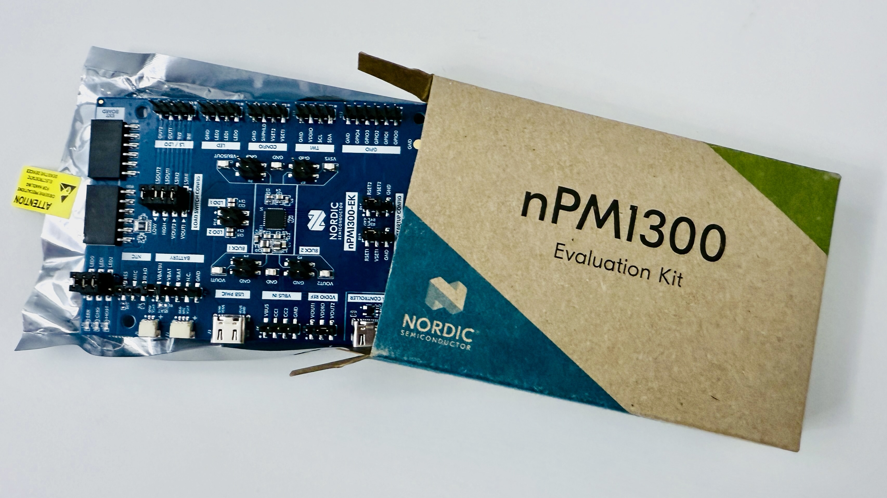
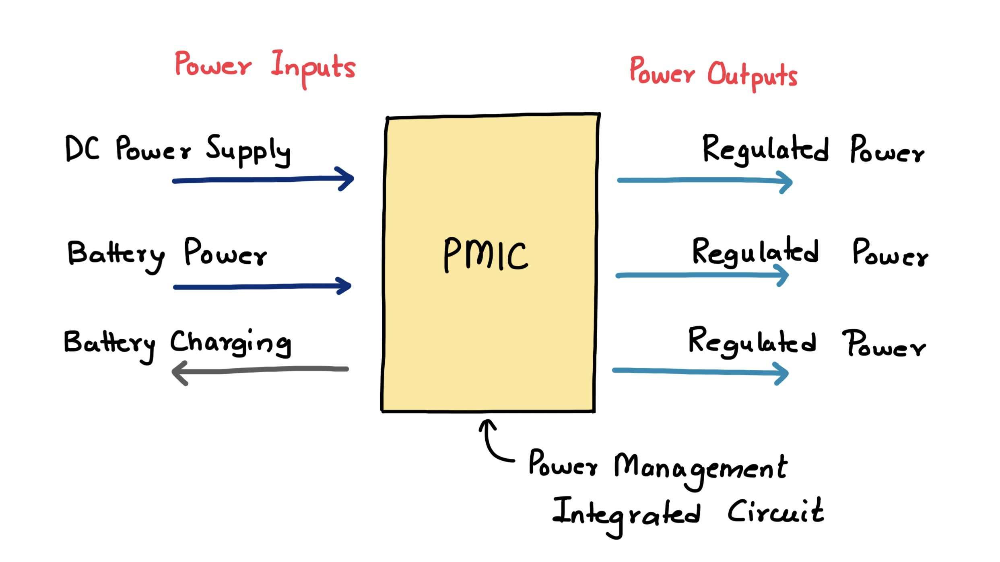
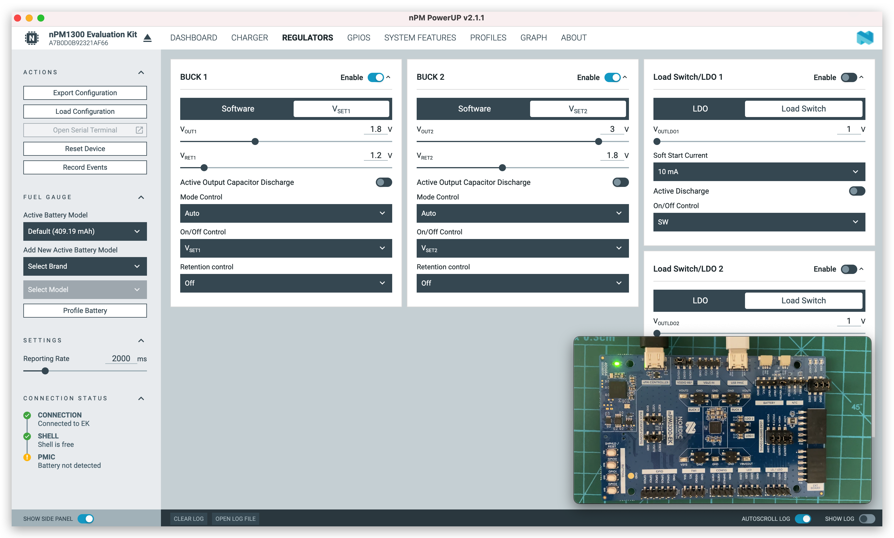

A Power Management Integrated Circuit (PMIC) is a critical component in modern electronic devices, designed to manage power requirements efficiently. It takes input from a DC power supply or a battery, delivers regulated power to various system components, and often includes functionality to charge an onboard battery.

<!--more-->

A PMIC integrates multiple power management functions into a single chip, optimizing energy usage and reducing system complexity. Its primary functions include:

# Voltage Regulation

PMICs convert input voltages from a DC power supply (e.g., USB or wall adapter) or a battery into stable, regulated voltages required by different components, such as processors, memory, or sensors. This is achieved through:
- `DC-DC Converters`: Buck converters step down voltage, while boost converters step it up, ensuring efficient power delivery.
- `Low-Dropout Regulators (LDOs)`: Provide precise, low-noise voltage for sensitive components.

# Battery Management

PMICs manage battery charging and discharging. They regulate the charging process to ensure safety and longevity, supporting protocols like constant current/constant voltage (CC/CV) charging for lithium-ion batteries. Key features include:
 - Overcharge and over-discharge protection.
 - Thermal regulation to prevent overheating.
 - Battery status monitoring (e.g., state of charge).

# Power Sequencing

Many electronic systems require components to power on or off in a specific order to avoid damage or instability. PMICs ensure proper sequencing by controlling the timing of voltage rails.

# Power Path Management

PMICs intelligently switch between power sources (e.g., battery or external DC supply) to ensure uninterrupted operation. For example, when a device is plugged in, the PMIC may prioritize the external supply while simultaneously charging the battery.

# Additional Features
   Modern PMICs often include auxiliary functions like:
   - Power monitoring and reporting.
   - Sleep or low-power modes for energy conservation.
   - Protection mechanisms against overvoltage, overcurrent, or short circuits.

The PMIC achieves these functions through a combination of analog and digital circuits, including switching regulators, control logic, and communication interfaces (e.g., I2C or SPI) for configuration and monitoring.

# Applications of PMICs

PMICs are ubiquitous in battery-powered and energy-conscious devices, including:
- **Consumer Electronics**: Smartphones, tablets, laptops, and wearables rely on PMICs to manage power for processors, displays, and peripherals while optimizing battery life.
- **IoT Devices**: Low-power sensors and connected devices use PMICs to operate efficiently in energy-constrained environments.
- **Automotive Systems**: PMICs regulate power in electric vehicles, infotainment systems, and advanced driver-assistance systems (ADAS).
- **Medical Devices**: Portable diagnostic tools and implantable devices use PMICs for reliable power delivery and battery management.
- **Industrial Equipment**: PMICs ensure stable power in robotics, automation systems, and other industrial applications.

# Importance of PMICs
PMICs play a pivotal role in modern electronics for several reasons:
1. **Energy Efficiency**: By optimizing power delivery and reducing losses, PMICs extend battery life and lower energy consumption, which is critical for portable devices and sustainable technology.
1. **System Reliability**: Precise voltage regulation and protection mechanisms prevent damage to sensitive components, enhancing device durability and safety.
1. **Compact Design**: By integrating multiple power management functions into a single chip, PMICs reduce the need for discrete components, enabling smaller, lighter devices.
1. **Cost Savings**: The consolidation of power management functions lowers manufacturing costs and simplifies design, benefiting both manufacturers and consumers.
1. **Flexibility**: Configurable PMICs support a wide range of applications, allowing designers to tailor power management to specific system requirements.

While PMICs are highly effective, they face challenges such as thermal management in high-power applications and the need for compatibility with diverse battery chemistries. Future trends in PMIC development include:
- **Advanced Process Nodes**: Smaller, more efficient PMICs using cutting-edge semiconductor processes.
- **Integration with AI**: PMICs that dynamically adjust power based on workload, leveraging machine learning for optimization.
- **Support for Fast Charging**: Enhanced charging protocols to support rapid, safe battery charging.
- **Wide Bandgap Semiconductors**: Use of materials like GaN or SiC for higher efficiency in high-power applications.
