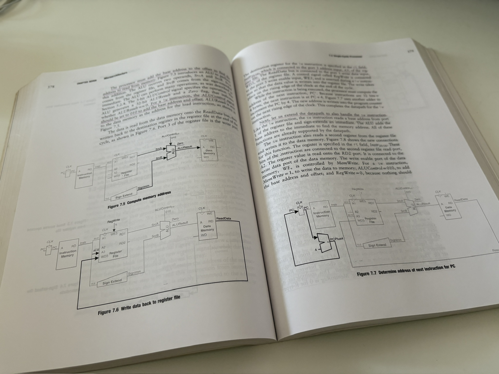

Few days back I decided to implement a RISC-V rv32i CPU and deploy it on an FPGA. Here are some initial thoughts on how I will go about doing this (and potentially you can follow).

<!--more-->

As part of the journey. I am going to journal the ideas and execution in a series of blog posts. This is not the first time I am venturing into writing a CPU from scratch. I have written a MIPS[^1] and RISC-V[^2] CPUs in the past. The MIPS CPU implemented a very minimal subset and the RISC-V one... that's just a skeleton for a project.

In both cases, I had only attempted a Single cycle CPU with a subset of instructions. While I could deploy the MIPS CPU on a Cyclone V FPGA based DE1SoC, the RISC-V project was abandoned. I wanted to base RISC-V project on verilator based simulation.

The book by **Harris and Harris** is a great reference. I am going to read that again and this time around implement the Multi Cycle CPU.

The book goes into explaining the details of implementation and provides sample code. The reference code serves as training wheels and greatly reduces the distraction resulted from the HDL[^3] related errors.

## Plan

Here is the rough plan -

### Language

I am going to implement the CPU either in `Verilog` or `System Verilog`. I have prior experience with these. This time around I am hoping to be less distracted by the language/debugging and be able to focus on the design/implementation.

### Deployment

While I want the CPU to be deployed on the FPGA. It would make sense that I first get it going in a simulator and test it thoroughly. I wouldn't want the logic errors to seep into and mix with the signal level debugging that'll need to be done on the FPGA. The choice of FPGA is not clear at the moment, I do have some FPGAs from `Lattice`. May be I'll just use one of those.

### Instruction Set

`rv32i` is open source instruction set[^5]. I will just use that. I am not clear on what instructions to implement first. Most likely the ones needed to make the CPU turing complete. Something like - `load`, `store`, `add`, `subtract` and `branching` related.

[^1]: Verilog implementation of a subset of MIPS 32 Bit Processor Instructions, ISA design, Assembler Design and Compiler design - [repository](https://github.com/streetdogg/mips-cpu).

[^2]: Implements a RISC-V CPU (rv32i) with base ISA - [repository](https://github.com/streetdogg/riscv-cpu-rtl).

[^3]: Hardware Definition Language(s). `VHDL` and `Verilog` are examples and they let the designer describe the digital circuit as a text file.

[^4]: This means that I will be describing the CPU state machine as text.

[^5]: The instruction set is listed in the [RISC-V Card](https://github.com/jameslzhu/riscv-card/releases/download/latest/riscv-card.pdf).
